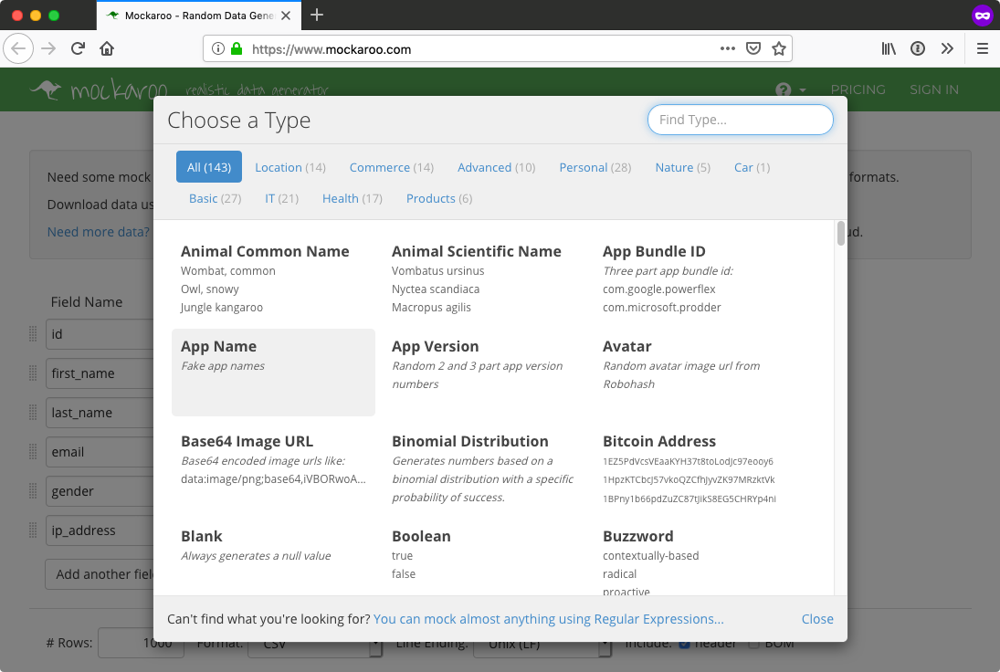

# Your turn to try Responder


You want to give [Responder](https://python-responder.org/en/latest/) a try yourself? Here's a simple set of steps to explore the framework (not a step by step tutorial but a roadmap, let's say).

We are going to use [Mockaroo](https://www.mockaroo.com/), service that generates realistic fake data (an oxymoron indeed).

[](https://www.mockaroo.com/)

Your goal will be to create a REST API built upon fake, static in-memory data to keep things simple. So head on over to [Mockaroo](https://www.mockaroo.com/) and create a new schema. 

You can see the types of data you can generate by clicking the folder icon in the type column. Browse through there and choose some sort of fake data and generate 1,000 rows and download it as JSON.

Then create a Python virtual environment, activate it, `pip install responder`, and create an `app.py` file.

Add two API endpoints, one for a list of items in your data set (or to search it) and another to return a single item.

You'll need to load the JSON data into an in-memory structure to get started. Here's some code along those lines.

```python
import os
import json

data = []
data_file = os.path.join(folder, 'MOCK_DATA.json')
with open(data_file, 'r', encoding='utf-8') as fin:
    data = json.load(fin)
```

Then to define an API endpoint that returns JSON, it's something like:

```python
@api.route('/api/search/{keyword}')
def search_by_keyword(_, resp: responder.Response, keyword: str):
    movies = get_data(keyword)
    resp.media = {'keyword': keyword, 'hits': movies}
```

You can always look back at the demo code. Enjoy the lap around [Responder](https://python-responder.org/en/latest/).
